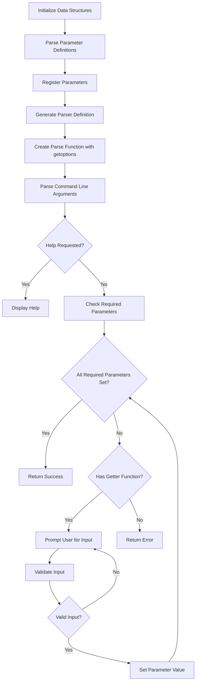
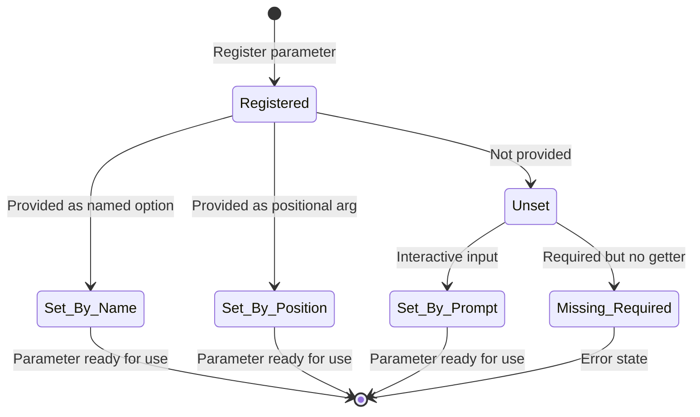
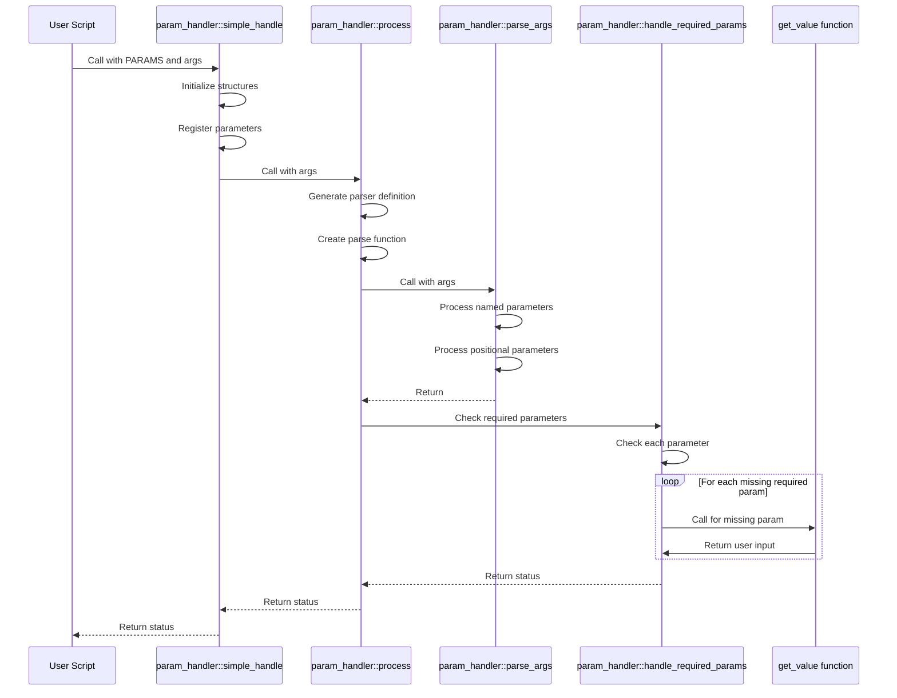
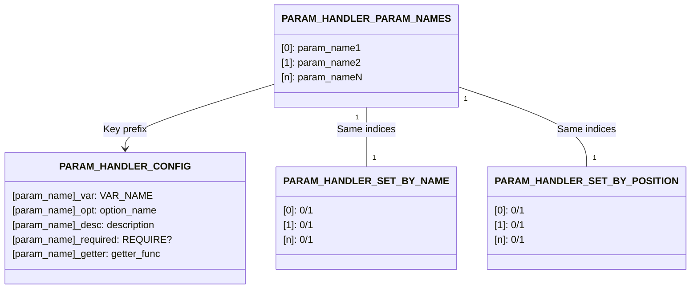
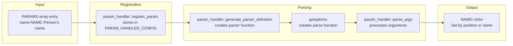
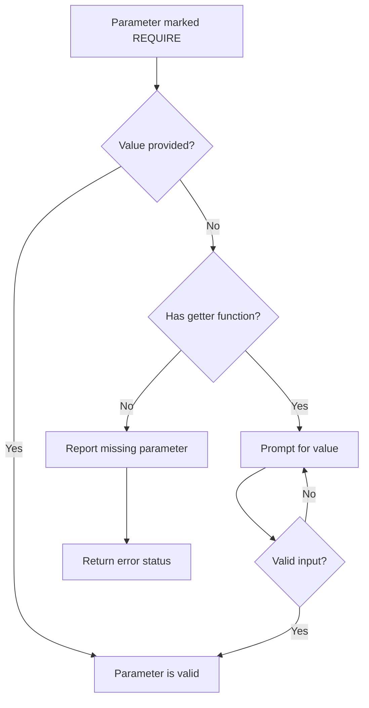

# Parameter Handler Data Flow Documentation

## Overview

This document explains the data flow and code structure of the `param_handler.sh` library, focusing on how it manages required parameters.

## Data Structures

The library uses these global data structures:

```bash
declare -gA PARAM_HANDLER_CONFIG        # Associative array for parameter metadata
declare -ga PARAM_HANDLER_PARAM_NAMES=() # Ordered array of parameter names
declare -ga PARAM_HANDLER_SET_BY_NAME=() # Tracks parameters set by name
declare -ga PARAM_HANDLER_SET_BY_POSITION=() # Tracks parameters set by position
declare -gi PARAM_HANDLER_NAMED_COUNT=0  # Count of parameters set by name
declare -gi PARAM_HANDLER_POSITIONAL_COUNT=0 # Count of parameters set by position
```

## Parameter Definition

Parameters can be defined using a colon-separated format:

```bash
# Format: "internal_name:VAR_NAME:option_name:description:REQUIRE:validator_func"
declare -a PARAMS=(
    # Optional parameter (standard)
    "name:NAME::Person's name"
    
    # Required parameter with validator (using param name as option name)
    "age:AGE:age:Person's age (required, 1-120):REQUIRE:validate_age"
    
    # Required parameter with custom option name and validator
    "email:EMAIL:email-address:Email address (required):REQUIRE:validate_email"
)
```

## Data Flow for Required Parameters

1. **Registration Phase**
   - Parameters are registered using `param_handler::register_param`
   - The `REQUIRE` flag is stored in `PARAM_HANDLER_CONFIG["${param_name}_required"]`
   - Validator functions are stored in `PARAM_HANDLER_CONFIG["${param_name}_getter"]`

2. **Parsing Phase**
   - Command-line arguments are parsed with getoptions
   - Named parameters are identified and stored
   - Positional parameters are assigned to remaining parameters
   - Tracking arrays are updated to record how each parameter was set

3. **Validation Phase**
   - `param_handler::handle_required_params` checks each parameter
   - If a required parameter has no value and no getter function, reports error
   - If a required parameter has no value but has a getter function, prompts user

## Key Functions

### param_handler::register_param

```bash
param_handler::register_param() {
    local param_name="$1"
    local var_name="$2"
    local option_name="$3"
    local description="$4"
    local required="${5:-}"
    local getter_func="${6:-}"
    
    PARAM_HANDLER_CONFIG["${param_name}_var"]="${var_name}"
    PARAM_HANDLER_CONFIG["${param_name}_opt"]="${option_name}"
    PARAM_HANDLER_CONFIG["${param_name}_desc"]="${description}"
    PARAM_HANDLER_CONFIG["${param_name}_required"]="${required}"
    PARAM_HANDLER_CONFIG["${param_name}_getter"]="${getter_func}"
    
    # Add to param names array
    PARAM_HANDLER_PARAM_NAMES+=("${param_name}")
}
```

### param_handler::handle_required_params

```bash
param_handler::handle_required_params() {
    local missing_required=0
    
    for i in "${!PARAM_HANDLER_PARAM_NAMES[@]}"; do
        local param_name="${PARAM_HANDLER_PARAM_NAMES[$i]}"
        local var_name="${PARAM_HANDLER_CONFIG["${param_name}_var"]}"
        local required="${PARAM_HANDLER_CONFIG["${param_name}_required"]}"
        local getter_func="${PARAM_HANDLER_CONFIG["${param_name}_getter"]}"
        local description="${PARAM_HANDLER_CONFIG["${param_name}_desc"]}"
        local opt_name="${PARAM_HANDLER_CONFIG["${param_name}_opt"]}"
        
        # Get current value
        local value="${!var_name}"
        
        # Skip if not required or already has a value
        if [[ "$required" != "REQUIRE" || -n "$value" ]]; then
            continue
        fi
        
        # If no getter function, mark as missing required
        if [[ -z "$getter_func" ]]; then
            log_error "Missing required parameter: --${opt_name} (${description})"
            missing_required=1
            continue
        fi
        
        # Call getter function to prompt for value
        echo -e "${YELLOW}Missing required parameter:${NC} ${description}"
        local new_value
        
        # Call get_value function with the getter function as validator
        new_value=$(get_value "${description}" "" "$getter_func" "Invalid input for ${description}")
        
        # Set the variable with the new value
        declare -g "${var_name}=${new_value}"
        
        # Update parameter tracking
        PARAM_HANDLER_SET_BY_NAME[i]=1
        PARAM_HANDLER_NAMED_COUNT=$((PARAM_HANDLER_NAMED_COUNT + 1))
    done
    
    return $missing_required
}
```

### param_handler::simple_handle

This is a simplified interface for parameter handling:

```bash
param_handler::simple_handle() {
    local param_array_name="$1"
    shift
    
    # Initialize
    param_handler-init
    
    # Get the ordered array with parameter definitions
    local -n param_array="$param_array_name"
    
    # Register parameters from the ordered array - preserves exact ordering
    for item in "${param_array[@]}"; do
        # Split by colon into array parts
        IFS=':' read -ra parts <<< "$item"
        
        # Extract parts based on number provided
        local internal_name="${parts[0]}"
        local var_name="${parts[1]}"
        local option_name="${internal_name}" # Default to internal_name
        local description=""
        local required=""
        local getter_func=""
        
        # Handle different formats based on the number of parts
        case ${#parts[@]} in
            2) # internal_name:VAR_NAME
                ;;
            3) # internal_name:VAR_NAME:option_name or internal_name:VAR_NAME:description
                # If 3rd part contains spaces, treat as description
                if [[ "${parts[2]}" == *" "* ]]; then
                    description="${parts[2]}"
                else
                    option_name="${parts[2]}"
                fi
                ;;
            4) # internal_name:VAR_NAME:option_name:description
                option_name="${parts[2]}"
                description="${parts[3]}"
                ;;
            5) # internal_name:VAR_NAME:option_name:description:REQUIRE
                option_name="${parts[2]}"
                description="${parts[3]}"
                required="${parts[4]}"
                ;;
            6) # internal_name:VAR_NAME:option_name:description:REQUIRE:getter_func
                option_name="${parts[2]}"
                description="${parts[3]}"
                required="${parts[4]}"
                getter_func="${parts[5]}"
                ;;
        esac
        
        # Register the parameter
        param_handler::register_param "$internal_name" "$var_name" "$option_name" "$description" "$required" "$getter_func"
    done
    
    # Process the parameters with help handling
    local result
    param_handler::process --handle-help "$@"
    result=$?
    
    # Return appropriate exit code
    if [[ $result -eq 1 ]]; then
        return 1  # Help was displayed
    elif [[ $result -eq 2 ]]; then
        echo -e "${RED}Error: Required parameters missing${NC}" >&2
        return 2  # Required parameters missing
    fi
    
    return 0
}
```

## Example PARAM_HANDLER_CONFIG Contents

After processing a parameter set like the one in `params_required_example.sh`, the `PARAM_HANDLER_CONFIG` would contain:

```
name_var = NAME
name_opt = name
name_desc = Person's name
name_required = 
name_getter = 

age_var = AGE
age_opt = age
age_desc = Person's age (required, 1-120)
age_required = REQUIRE
age_getter = validate_age

email_var = EMAIL
email_opt = email-address
email_desc = Email address (required)
email_required = REQUIRE
email_getter = validate_email

location_var = LOCATION
location_opt = place
location_desc = Person's location
location_required = 
location_getter = 
```

## Required Parameter Detection

The detection of required parameters happens in multiple functions:

1. When generating the parser definition:
   ```bash
   if [[ "$required" == "REQUIRE" ]]; then
       echo "    param ${var_name} --${opt_name} -- \"${description} (REQUIRED)\""
   ```

2. When handling required params:
   ```bash
   if [[ "$required" != "REQUIRE" || -n "$value" ]]; then
       continue
   ```

3. When displaying parameter info:
   ```bash
   if [[ "$required" == "REQUIRE" ]]; then
       echo -e "${BLUE}${var_name}:${NC} ${color}${value}${NC} (${source}) ${MAGENTA}[REQUIRED]${NC}"
   ```

## Full Control Flow

1. User defines parameters in a simple array format
2. `param_handler::simple_handle` parses these definitions
3. Parameters are registered in the global config
4. Arguments are parsed and assigned
5. Required parameters are checked
6. If any required parameters have no value:
   - If they have a validator/getter function, prompt the user
   - If not, return an error code

## Usage Example

```bash
# Define parameters
declare -a PARAMS=(
    "name:NAME::Person's name"
    "age:AGE:age:Person's age (required, 1-120):REQUIRE:validate_age"
    "email:EMAIL:email-address:Email address (required):REQUIRE:validate_email"
    "location:LOCATION:place:Person's location"
)

# Process parameters
if ! param_handler::simple_handle PARAMS "$@"; then
    if [[ -n "$help" ]]; then
        exit 0  # Help displayed
    else
        exit 1  # Required parameters missing
    fi
fi

# Use the parameters
echo "Name: ${NAME}"
echo "Age: ${AGE}"
echo "Email: ${EMAIL}"
echo "Location: ${LOCATION}"
```

## Runtime Data Flow

This section illustrates the runtime execution flow with concrete examples.

### Command Line Processing Example

Let's trace what happens when a user runs a script with these arguments:

```bash
./script.sh --email user@example.com 25
```

With the parameter definition:
```bash
declare -a PARAMS=(
    "name:NAME::Person's name"
    "age:AGE:age:Person's age (required, 1-120):REQUIRE:validate_age"
    "email:EMAIL:email-address:Email address (required):REQUIRE:validate_email"
)
```

1. **Initialize data structures**:
   ```bash
   PARAM_HANDLER_CONFIG=()                # Empty associative array
   PARAM_HANDLER_PARAM_NAMES=()           # Empty parameter names array
   PARAM_HANDLER_SET_BY_NAME=()           # Empty tracking array
   PARAM_HANDLER_SET_BY_POSITION=()       # Empty tracking array
   PARAM_HANDLER_NAMED_COUNT=0            # Reset counter
   PARAM_HANDLER_POSITIONAL_COUNT=0       # Reset counter
   ```

2. **Register parameters** (after param_handler::simple_handle processes PARAMS):
   ```bash
   PARAM_HANDLER_PARAM_NAMES=("name" "age" "email")
   PARAM_HANDLER_CONFIG["name_var"]="NAME"
   PARAM_HANDLER_CONFIG["name_opt"]="name"
   PARAM_HANDLER_CONFIG["name_desc"]="Person's name"
   PARAM_HANDLER_CONFIG["name_required"]=""
   # ...and so on for age and email...
   ```

3. **Parse command line arguments**:
   - Detects `--email user@example.com` as a named parameter
   - Sets `EMAIL="user@example.com"`
   - Updates tracking: `PARAM_HANDLER_SET_BY_NAME=(0 0 1)`
   - Updates counter: `PARAM_HANDLER_NAMED_COUNT=1`
   
   - Detects `25` as a positional parameter
   - Assigns to the first non-named parameter: `NAME="25"`
   - Updates tracking: `PARAM_HANDLER_SET_BY_POSITION=(1 0 0)`
   - Updates counter: `PARAM_HANDLER_POSITIONAL_COUNT=1`

4. **Check required parameters**:
   - Parameter "age" is required but not set
   - Has validator function "validate_age"
   - Prompts user for input: "Missing required parameter: Person's age"
   - User enters: 30
   - Validates input with validate_age()
   - Sets `AGE="30"`
   - Updates tracking: `PARAM_HANDLER_SET_BY_NAME=(0 1 1)`
   - Updates counter: `PARAM_HANDLER_NAMED_COUNT=2`

5. **Final parameter state**:
   - `NAME="25"` (set by position)
   - `AGE="30"` (set by interactive prompt)
   - `EMAIL="user@example.com"` (set by name)

### Interactive Prompting Sequence

When a required parameter is missing but has a validator, the process is:

1. Detect missing parameter in `param_handler::handle_required_params`
2. Check if parameter has a getter function
3. If yes, display prompt: `"Missing required parameter: [description]"`
4. Call `get_value()` with the validator function
5. If user input fails validation:
   - Display error message from validator
   - Prompt again until valid input received
6. Upon valid input:
   - Set the parameter value
   - Mark parameter as set by name
   - Increment the named count

### Error Handling Flow

When required parameters are missing:

1. If parameter has no getter function:
   - Log error: `log_error "Missing required parameter: --${opt_name} (${description})"`
   - Set `missing_required=1`
   - Continue checking other parameters

2. After all parameters are checked, if `missing_required=1`:
   - `param_handler::handle_required_params` returns non-zero status
   - `param_handler::process` returns status code 2
   - `param_handler::simple_handle` shows error message and returns code 2
   - Calling script should handle this by displaying appropriate error and exiting

### Tracking Parameter Sources

The two tracking arrays `PARAM_HANDLER_SET_BY_NAME` and `PARAM_HANDLER_SET_BY_POSITION` maintain parallel indexes with `PARAM_HANDLER_PARAM_NAMES`. For each parameter:

- `PARAM_HANDLER_SET_BY_NAME[i]=1` if parameter was set via named option
- `PARAM_HANDLER_SET_BY_POSITION[i]=1` if parameter was set via positional argument
- Both are 0 if parameter wasn't set or was set by interactive prompt

This tracking enables functions like `param_handler::was_set_by_name()` to report how a parameter was provided, useful for debugging and user feedback.

### Full Process Sequence

The complete runtime sequence when calling `param_handler::simple_handle`:

1. Initialize data structures
2. Parse parameter definitions
3. Register each parameter
4. Generate parser definition string
5. Create parse function with getoptions
6. Parse command line arguments with param_handler::parse_args
7. Check if help was requested
8. Process required parameters with param_handler::handle_required_params
9. Return appropriate status code
10. Script continues execution with parameters set

If any required parameters are missing and cannot be resolved through interactive prompting, the process terminates with an error status. 

## Parser Definition Generation

The `param_handler.sh` library generates a parser definition compatible with `getoptions.sh`. Let's compare a standard getoptions parser definition with what param_handler generates.

### Standard getoptions Parser Definition

Here's a basic parser definition as used directly with getoptions:

```bash
parser_definition() {
  setup   REST help:usage -- "Usage: example.sh [options]... [arguments]..." ''
  msg -- 'Options:'
  flag    FLAG    -f --flag                 -- "takes no arguments"
  param   PARAM   -p --param                -- "takes one argument"
  option  OPTION  -o --option on:"default"  -- "takes one optional argument"
  disp    :usage     --help
  disp    VERSION    --version
}
```

### Generated Parser Definition by param_handler

The `param_handler::generate_parser_definition()` function dynamically creates a similar parser definition based on registered parameters:

```bash
param_handler::generate_parser_definition() {
    local func_name="${1:-param_handler::parser_definition}"
    
    echo "${func_name}() {"
    echo "    setup REST help:usage -- \"Usage: \${0##*/} [OPTIONS] [POSITIONAL_PARAMS]\" ''"
    echo "    msg -- 'Options:'"
    echo "    flag help -h --help -- \"Show help message\""
    
    # Add each registered parameter
    for param_name in "${PARAM_HANDLER_PARAM_NAMES[@]}"; do
        local var_name="${PARAM_HANDLER_CONFIG["${param_name}_var"]}"
        local opt_name="${PARAM_HANDLER_CONFIG["${param_name}_opt"]}"
        local description="${PARAM_HANDLER_CONFIG["${param_name}_desc"]}"
        local required="${PARAM_HANDLER_CONFIG["${param_name}_required"]}"
        
        if [[ "$required" == "REQUIRE" ]]; then
            echo "    param ${var_name} --${opt_name} -- \"${description} (REQUIRED)\""
        else
            echo "    param ${var_name} --${opt_name} -- \"${description}\""
        fi
    done
    
    echo "    disp :usage -h --help"
    echo "}"
}
```

### Example Generated Output

For our sample parameter set:
```bash
declare -a PARAMS=(
    "name:NAME::Person's name"
    "age:AGE:age:Person's age (required, 1-120):REQUIRE:validate_age"
    "email:EMAIL:email-address:Email address (required):REQUIRE:validate_email"
    "location:LOCATION:place:Person's location"
)
```

The generated parser definition would be:

```bash
param_handler::parser_definition_alt() {
    setup REST help:usage -- "Usage: ${0##*/} [OPTIONS] [POSITIONAL_PARAMS]" ''
    msg -- 'Options:'
    flag help -h --help -- "Show help message"
    param NAME --name -- "Person's name"
    param AGE --age -- "Person's age (required, 1-120) (REQUIRED)"
    param EMAIL --email-address -- "Email address (required) (REQUIRED)"
    param LOCATION --place -- "Person's location"
    disp :usage -h --help
}
```

### Parser Function Types

In getoptions, there are different types of parameter definitions:

1. `flag` - Boolean flags that take no arguments (e.g., `--help`)
2. `param` - Parameters that require arguments (e.g., `--name John`)
3. `option` - Parameters with optional arguments (can have defaults)
4. `disp` - Display functions (like help)

param_handler.sh primarily uses `param` type for all parameters, since it's designed to handle named parameters that require values. It also includes the standard `flag` for help and `disp` for displaying help.

### How It Works with getoptions

1. param_handler generates the parser definition as a string
2. It uses eval to create the function dynamically
3. It calls getoptions to create the parse function:
   ```bash
   eval "$(getoptions param_handler::parser_definition_alt parse)"
   ```
4. The parse function is then used to process command-line arguments

### Mapping Between Parameters and Parser Definition

| Parameter Format (PARAMS array entry) | Generated Parser Line | Explanation |
|--------------------------------------|------------------------|-------------|
| `"name:NAME::"` | `param NAME --name -- ""` | Basic parameter with empty description |
| `"name:NAME::Person's name"` | `param NAME --name -- "Person's name"` | Standard parameter with description |
| `"age:AGE:age:Person's age"` | `param AGE --age -- "Person's age"` | Parameter with custom option name |
| `"age:AGE:age:Person's age:REQUIRE"` | `param AGE --age -- "Person's age (REQUIRED)"` | Required parameter |
| `"email:EMAIL:email-address:Email address:REQUIRE:validate_email"` | `param EMAIL --email-address -- "Email address (REQUIRED)"` | Required with validator |
| `"flag:FLAG:flag:Boolean flag"` | `param FLAG --flag -- "Boolean flag"` | All registered as param type in getoptions |

And for comparison, if using getoptions directly:

| Direct getoptions definition | Explanation |
|------------------------------|-------------|
| `flag FLAG -f --flag -- "Boolean flag"` | Boolean flag (no value) |
| `param NAME -n --name -- "Person's name"` | Parameter requiring value |
| `option OPT -o --option on:"default" -- "Optional value"` | Parameter with optional value |

The param_handler library converts all parameters to the `param` type in getoptions, which always expects a value. This simplifies the interface at the cost of some flexibility, but ensures consistent handling of all parameters. 

## Visualizations

This section provides visual representations of the parameter handling system using Mermaid diagrams.

### Process Flow Diagram



### Parameter State Diagram



### Parameter Processing Sequence



### Parameter Data Structure Relationship



### Parameter Definition to Processed Parameter Flow



### Required Parameter Handling



These diagrams provide visual representations of the key workflows and relationships in the param_handler system. 