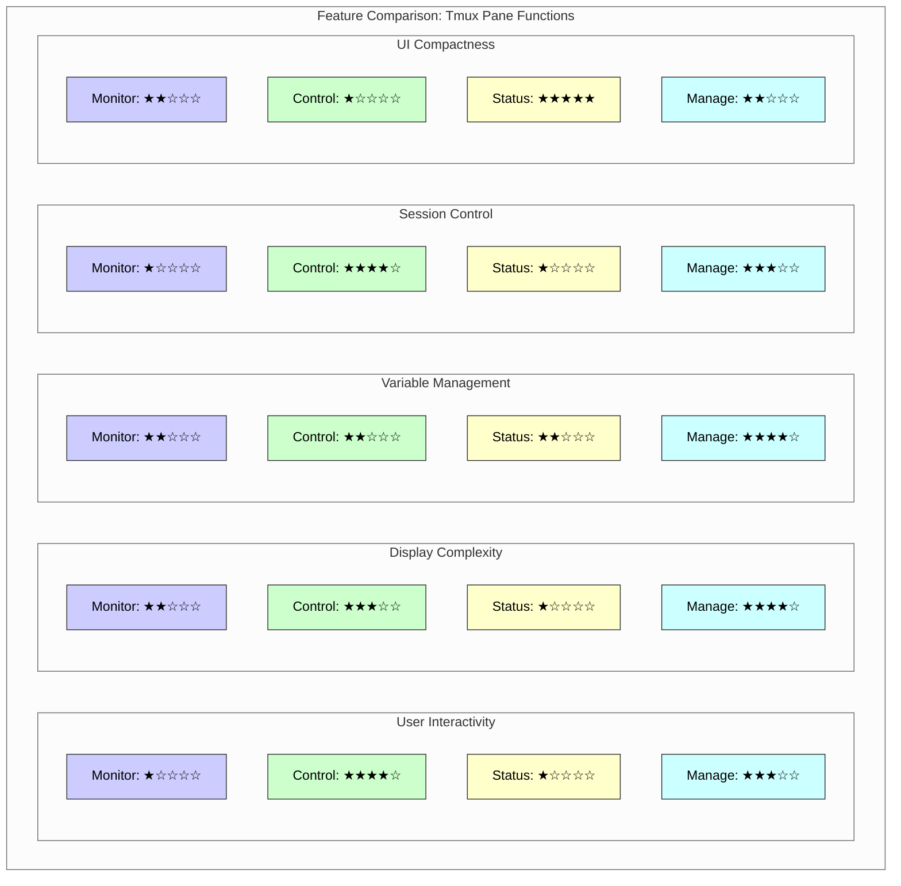
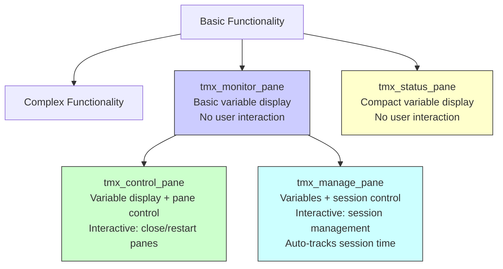

# Analysis of Tmux Pane Management Functions

This document provides a flowchart and comparison table for the tmux pane management functions found in `tmux_utils1.sh` (lines 1140-1650).

## Flowchart

```mermaid
graph TD
    subgraph User Interaction
        direction LR
        A[User Call]
    end

    subgraph tmux_utils1.sh
        direction TB
        A --> F2(tmx_monitor_pane)
        A --> F3(tmx_control_pane)
        A --> F4(tmx_status_pane)
        A --> F5(tmx_manage_pane)

        F2 --> F2_Internal(monitor_function)
        F2 --> TPF(tmx_pane_function)
        F2 --> TVS(tmx_var_set)
        F2_Internal --> TVG(tmx_var_get)
        F2_Internal --> MSG(Messaging: msg_*)

        F3 --> F3_Internal(control_function)
        F3 --> TPF
        F3 --> TVS
        F3_Internal --> TVG
        F3_Internal --> MSG
        F3_Internal --> TKP[tmux kill-pane]
        F3_Internal --> THP[tmux has-pane]
        F3_Internal --> TKS[tmux kill-session]

        F4 --> F4_Internal(status_function)
        F4 --> TPF
        F4 --> TVS
        F4_Internal --> TVG
        F4_Internal --> MSG

        F5 --> F5_Internal(manage_function)
        F5 --> TPF
        F5 --> TVS
        F5 --> TSE[tmux set-environment]
        F5_Internal --> TVG
        F5_Internal --> TVS
        F5_Internal --> TDM[tmux display-message]
        F5_Internal --> TSEnv[tmux show-environment]
        F5_Internal --> MSG
        F5_Internal --> TKS
    end

    subgraph External Dependencies
        direction LR
        TPF[tmx_pane_function]
        TVS[tmx_var_set]
        TVG[tmx_var_get]
        MSG[Messaging: msg_*]
        TKP[tmux kill-pane]
        TKS[tmux kill-session]
        THP[tmux has-pane]
        TDM[tmux display-message]
        TSEnv[tmux show-environment]
        TSE[tmux set-environment]
    end

    style F2 fill:#ccf,stroke:#333,stroke-width:2px
    style F3 fill:#cfc,stroke:#333,stroke-width:2px
    style F4 fill:#ffc,stroke:#333,stroke-width:2px
    style F5 fill:#cff,stroke:#333,stroke-width:2px

    style F2_Internal fill:#ccf,stroke:#669,stroke-width:1px,stroke-dasharray: 5 5
    style F3_Internal fill:#cfc,stroke:#696,stroke-width:1px,stroke-dasharray: 5 5
    style F4_Internal fill:#ffc,stroke:#996,stroke-width:1px,stroke-dasharray: 5 5
    style F5_Internal fill:#cff,stroke:#699,stroke-width:1px,stroke-dasharray: 5 5
```



**Legend:**

*   Solid Boxes: Functions defined in the selected script section.
*   Dashed Boxes: Internal helper functions defined within the main functions.
*   Rounded Boxes: External dependencies (other functions in `tmux_utils1.sh` or `tmux` commands).
*   Colors group related functions (`monitor`, `control`, `status`, `manage`).

## Sequence Diagram

```mermaid
sequenceDiagram
    actor User
    participant F2 as tmx_monitor_pane #ccf
    participant F3 as tmx_control_pane #cfc
    participant F4 as tmx_status_pane #ffc
    participant F5 as tmx_manage_pane #cff
    participant TPF as tmx_pane_function
    participant Deps as Other Dependencies <br/>(tmux, msg_*, tmx_var_*)

    User->>F2: Call(session, vars, ...)
    F2->>Deps: tmx_var_set (refresh)
    F2->>TPF: Call(session, monitor_function, ...)
    activate F2 #ccf
    Note right of F2: monitor_function runs
    F2->>Deps: Loop (tmx_var_get, msg_*, sleep)
    deactivate F2
    TPF-->>F2: pane_index
    F2-->>User: Return pane_index

    User->>F3: Call(session, vars, panes, ...)
    F3->>Deps: tmx_var_set (refresh)
    F3->>TPF: Call(session, control_function, ...)
    activate F3 #cfc
    Note right of F3: control_function runs
    F3->>Deps: Loop (tmx_var_get, msg_*, tmux has-pane, read, sleep)
    alt Input received
        F3->>Deps: tmux kill-pane (optional)
        F3->>Deps: tmux kill-session (optional)
    end
    deactivate F3
    TPF-->>F3: pane_index
    F3-->>User: Return pane_index

    User->>F4: Call(session, vars, ...)
    F4->>Deps: tmx_var_set (refresh)
    F4->>TPF: Call(session, status_function, ...)
    activate F4 #ffc
    Note right of F4: status_function runs
    F4->>Deps: Loop (tmx_var_get, msg_*, sleep)
    deactivate F4
    TPF-->>F4: pane_index
    F4-->>User: Return pane_index

    User->>F5: Call(session, vars, ...)
    F5->>Deps: tmux set-environment (refresh)
    F5->>Deps: tmx_var_set (init vars)
    F5->>TPF: Call(session, manage_function, ...)
    activate F5 #cff
    Note right of F5: manage_function runs
    F5->>Deps: Loop (tmx_var_set(time), tmux show-env/tmx_var_get, msg_*, read, sleep)
    alt Input received
        F5->>Deps: tmux kill-session (optional)
    end
    deactivate F5
    TPF-->>F5: pane_index
    F5-->>User: Return pane_index
```

## Comparison Table

| Feature          | `tmx_monitor_pane`                     | `tmx_control_pane`                                    | `tmx_status_pane`                     | `tmx_manage_pane`                                  |
| :--------------- | :------------------------------------- | :---------------------------------------------------- | :------------------------------------ | :------------------------------------------------- |
| **Purpose**      | Displays variable values in a pane.    | Displays variables & controls other panes.            | Displays variables in a compact status bar. | Displays variables & basic session control.         |
| **Arguments**    | session, vars, pane_opt, [refresh], [env] | session, vars, panes, pane_opt, [refresh], [env]      | session, vars, pane_opt, [refresh]  | session, vars, pane_opt, [refresh]               |
| **Pane Creation**| Yes (via `tmx_pane_function`)          | Yes (via `tmx_pane_function`)                         | Yes (via `tmx_pane_function`)         | Yes (via `tmx_pane_function`)                      |
| **Internal Func**| `monitor_function`                   | `control_function`                                  | `status_function`                   | `manage_function`                                |
| **Core Logic**   | Loop: clear, get/show vars, sleep      | Loop: clear, get/show vars, show panes, input, sleep | Loop: clear, get/show vars, sleep     | Loop: clear, get/show vars, input, sleep           |
| **Dependencies** | `msg_*`, `tmx_pane_function`, `tmx_var_set`, `tmx_var_get` | `msg_*`, `tmx_pane_function`, `tmx_var_set`, `tmx_var_get`, `tmx_kill_pane`, `tmux has-pane`, `tmux kill-session` | `msg_*`, `tmx_pane_function`, `tmx_var_set`, `tmx_var_get` | `msg_*`, `tmx_pane_function`, `tmx_var_set`, `tmx_var_get`, `tmux display-message`, `tmux show/set-environment`, `tmux kill-session` |
| **Control Features** | None                                   | Quit session, Kill specific pane, Check pane status | None                                  | Quit session, Show help                            |
| **Variable Handling**| Reads (`tmx_var_get`)                  | Reads (`tmx_var_get`)                               | Reads (`tmx_var_get`)                 | Reads (`tmx_var_get`/`show-environment`), Writes (`tmx_var_set`/`set-environment`) |
| **Input Handling**| No                                     | Yes (non-blocking read)                             | No                                    | Yes (non-blocking read)                            |

## Visual Comparison Diagrams

### Feature Radar Chart

The radar chart below visually represents how each function compares across different feature dimensions, with distance from center indicating strength in that feature area.



### Visual UI Mockup

Below is a mockup showing the typical appearance of each pane type in a tmux session:

```mermaid
graph TB
    subgraph "UI Mockups: How Panes Appear in Tmux"
        subgraph m["Monitor Pane (tmx_monitor_pane)"]
            direction TB
            m1["=== TMUX VARIABLE MONITOR ==="] --> m2["Session: my_session | Refresh: 1s | 14:32:05"] 
            m2 --> m3["-------------------------------"]
            m3 --> m4["var1: value1"]
            m4 --> m5["count_green: 42"]
            m5 --> m6["status_blue: running"]
        end

        subgraph c["Control Pane (tmx_control_pane)"]
            direction TB
            c1["=== TMUX CONTROL PANE ==="] --> c2["Session: my_session | Refresh: 1s | 14:32:05"]
            c2 --> c3["Controls: [q] Quit all | [r] Restart pane | [number] Close pane"]
            c3 --> c4["-------------------------------"] 
            c4 --> c5["= Variables ="]
            c5 --> c6["var1: value1"]
            c6 --> c7["count_green: 42"]
            c7 --> c8["status_blue: running"]
            c8 --> c9["= Panes ="]
            c9 --> c10["Pane 1: Running - press 1 to close"]
            c10 --> c11["Pane 2: Running - press 2 to close"]
        end

        subgraph s["Status Pane (tmx_status_pane)"]
            direction TB
            s1["SESSION: my_session | 14:32:05"] --> s2["━━━━━━━━━━━━━━━━━━━━━━━━━━━━━━━━━━━━━━━━━━━"]
            s2 --> s3["var1=value1 | count_green=42 | status_blue=running | session_time=127s"]
        end

        subgraph g["Management Pane (tmx_manage_pane)"]
            direction TB
            g1["=== TMUX MANAGER ==="] --> g2["SESSION: my_session | 14:32:05"]
            g2 --> g3["━━━━━━━━━━━━━━━━━━━━━━━━━━━━━━━━━━━━━━━━━━━"]
            g3 --> g4["= VARIABLES ="]
            g4 --> g5["var1: value1"]
            g5 --> g6["count_green: 42"]
            g6 --> g7["status_blue: running"]
            g7 --> g8["session_time: 127s"]
            g8 --> g9[" "]
            g9 --> g10["= CONTROLS ="]
            g10 --> g11["Press [q] to quit session | [h] for help"]
        end
    end

    style m fill:#ccf,stroke:#333,stroke-width:1px
    style c fill:#cfc,stroke:#333,stroke-width:1px
    style s fill:#ffc,stroke:#333,stroke-width:1px
    style g fill:#cff,stroke:#333,stroke-width:1px
```



### Key Functional Differences

The following diagram shows the hierarchy and relationship between the four pane functions, from simplest to most complex:



### Venn Diagram of Features

The following diagram shows the overlapping and unique features of each pane function:

```mermaid
graph TD
    subgraph "Features Shared & Unique"
        direction TB
        
        subgraph core["Core Features (All Panes)"]
            cv1["Display tmux variables"]
            cv2["Refresh periodically"]
            cv3["Use tmx_pane_function"]
        end
        
        subgraph monitor["tmx_monitor_pane"]
            mv1["Variable values with colors"]
            mv2["Simple interface"]
        end
        
        subgraph status["tmx_status_pane"]
            sv1["Compact single-line display"]
            sv2["Bold formatting for names"]
        end
        
        subgraph control["tmx_control_pane"]
            direction TB
            controlOnly["Unique to Control Pane:"]
            cc1["Keyboard shortcuts to close panes"]
            cc2["List of managed panes with status"]
            cc3["Restart capability"]
            cc4["Section for variables & panes"]
        end
        
        subgraph manage["tmx_manage_pane"]
            direction TB
            manageOnly["Unique to Management Pane:"]
            mg1["Session-level management"]
            mg2["Help system"]
            mg3["Automatic session time tracking"]
            mg4["Uses both environment vars & tmux vars"]
        end
        
        %% Shared features between specific panes
        
        %% Shared between control & manage
        controlManage["Shared Control & Management:"]
        cmg1["Interactive keyboard commands"]
        cmg2["Non-blocking input handling"]
        cmg3["Session termination capability"]
        
        %% Venn diagram styling
        style core fill:#eee,stroke:#999,stroke-width:1px,stroke-dasharray: 5 5
        style monitor fill:#ccf,stroke:#333,stroke-width:1px
        style status fill:#ffc,stroke:#333,stroke-width:1px
        style control fill:#cfc,stroke:#333,stroke-width:1px
        style manage fill:#cff,stroke:#333,stroke-width:1px
        style controlManage fill:#dfd,stroke:#393,stroke-width:1px,stroke-dasharray: 3 3
    end
```



This diagram illustrates the incremental increase in functionality across the four pane types. Both `tmx_monitor_pane` and `tmx_status_pane` are simple display panes with no interactivity, while `tmx_control_pane` and `tmx_manage_pane` add progressively more interactive features.

The Venn diagram shows that all four functions share core variable display capabilities, but each adds unique features, with the control and management panes sharing interactive capabilities that the monitor and status panes lack.