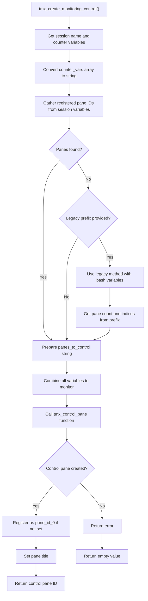
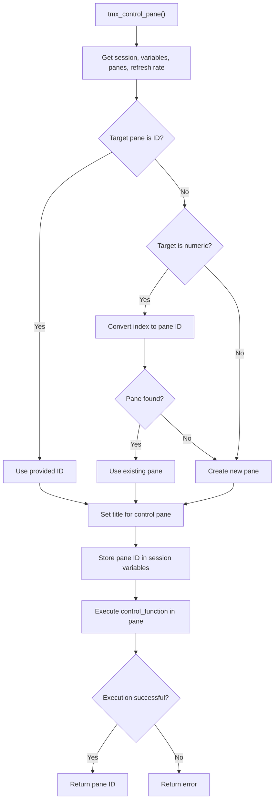
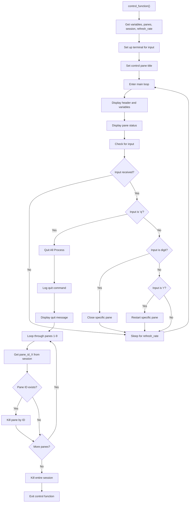
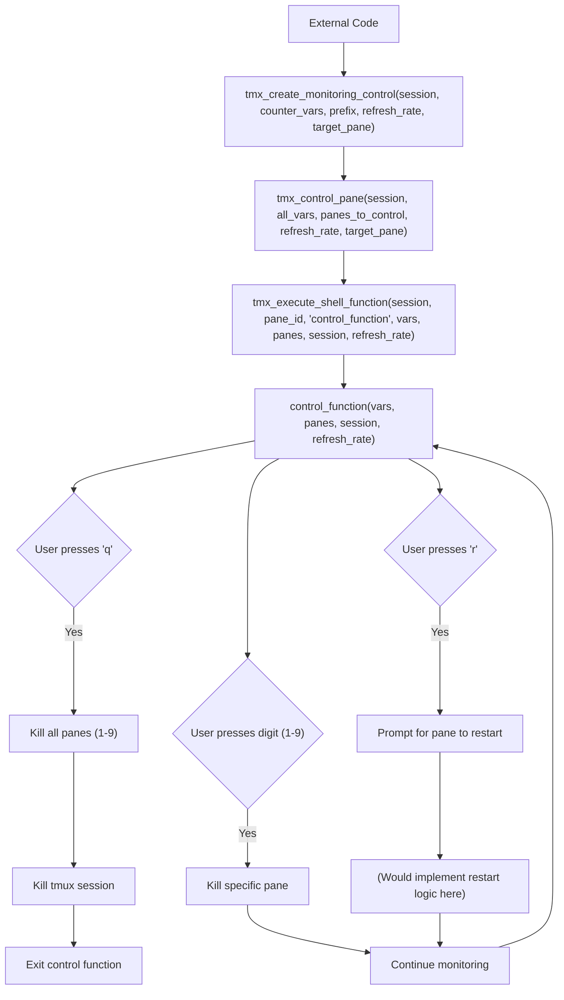
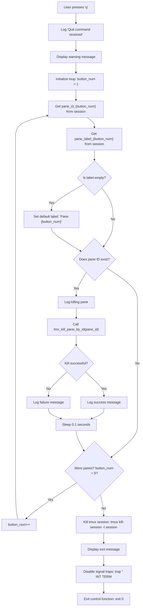

# `tmx_create_monitoring_control` Implementation Flowchart

## Main Function Flow



### Code Implementation for Main Function

```bash
# Returns: The pane ID of the control pane
tmx_create_monitoring_control() {
    # A: Get session name and counter variables
    local session="${1}"
    local -n counter_vars_ref="${2}"  # Name reference to counter vars array
    local pane_ids_prefix="${3:-}"    # Prefix for pane ID variables (optional)
    local refresh_rate="${4:-1}"
    local target_pane="${5:-0}"  
    
    msg_debug "Creating monitoring control pane in session '${session}'"
    
    # B: Convert counter vars array to space-separated string
    local counter_vars_str=""
    for var in "${counter_vars_ref[@]}"; do
        counter_vars_str+="${var} "
    done
    
    # C: Get registered pane IDs from session variables (NOT relying on bash variables)
    local pane_id_vars=""
    local panes_to_control=""
    local i=1
    
    # Find all pane_id_X variables in session
    while true; do
        local id_value=$(tmx_var_get "pane_id_${i}" "${session}" 2>/dev/null)
        if [[ -z "${id_value}" ]]; then
            break  # No more pane IDs found
        fi
        
        # Add to variables to monitor
        pane_id_vars+="pane_id_${i} "
        
        # Add to panes to control
        panes_to_control+="${i} "
        
        i=$((i + 1))
    done
    
    # D-G: If no panes found but prefix is provided, try legacy method
    if [[ -z "${panes_to_control}" && -n "${pane_ids_prefix}" ]]; then
        # Legacy method using bash variables
        local count_var="${pane_ids_prefix}_COUNT"
        local pane_count="${!count_var:-0}"
        
        for ((i=1; i<=pane_count; i++)); do
            pane_id_vars+="pane_id_${i} "
        done
        
        # Use indices array from prefix
        local indices_var="${pane_ids_prefix}_INDICES"
        panes_to_control="${!indices_var:-}"
    fi
    
    # I: Combine all variables to monitor
    local all_vars="${counter_vars_str} ${pane_id_vars}"
    all_vars="${all_vars% }"  # Remove trailing space
    
    # Trim trailing space from panes_to_control
    panes_to_control="${panes_to_control% }"
    
    msg_debug "Monitoring variables: ${all_vars}"
    msg_debug "Controlling panes: ${panes_to_control}"
    
    # J: Call the control pane function with the prepared arguments
    local control_pane_id
    control_pane_id=$(tmx_control_pane "${session}" "${all_vars}" "${panes_to_control}" "${refresh_rate}" "${target_pane}")
    
    # K-L: Register this as pane_id_0 if not already set
    if [[ -n "${control_pane_id}" ]]; then
        if [[ -z "$(tmx_var_get "pane_id_0" "${session}" 2>/dev/null)" ]]; then
            tmx_var_set "pane_id_0" "${control_pane_id}" "${session}"
            tmx_var_set "pane_label_0" "Control" "${session}"
            tmx_var_set "pane_func_0" "control_function" "${session}"
            
            # N: Set a title for the control pane
            local pane_title="L:Control | F:control_function | btn:0"
            tmx_set_pane_title "${session}" "${control_pane_id}" "${pane_title}"
        fi
    fi
    
    # O: Return the control pane ID
    echo "${control_pane_id}"
    return 0
}
```

## `tmx_control_pane` Function Flow



### Code Implementation for `tmx_control_pane`

```bash
# Returns: The pane ID of the control pane
tmx_control_pane() {
    # A: Get session, variables, panes, refresh rate
    local session="${1}"
    local vars="${2}"
    local panes="${3}"
    local refresh_rate="${4:-1}"
    local target_pane="${5:-0}"  # Default to using pane 0
    
    msg_debug "Creating control pane in session '${session}', target: ${target_pane}"
    
    local control_pane_id=""
    
    # B: Check if target_pane is already a pane ID
    if [[ "${target_pane}" =~ ^%[0-9]+$ ]]; then
        # C: Use the provided pane ID
        control_pane_id="${target_pane}"
        msg_debug "Using provided pane ID: ${control_pane_id}"
    # D: Check if target is numeric (pane index)
    elif [[ "${target_pane}" =~ ^[0-9]+$ ]]; then
        # E: Convert index to pane ID
        control_pane_id=$(tmx_get_pane_id "${session}" "${target_pane}")
        # G-H: Check if pane was found
        if [[ -z "${control_pane_id}" ]]; then
            msg_warning "Could not find pane with index ${target_pane}, creating new pane"
            # F: Create a new horizontal pane as fallback with control title
            control_pane_id=$(tmx_create_pane "${session}" "h")
        else
            msg_debug "Using pane with index ${target_pane}, ID: ${control_pane_id}"
        fi
    else
        # F: Invalid target, create a new pane with title
        msg_warning "Invalid target pane '${target_pane}', creating new pane"
        control_pane_id=$(tmx_create_pane "${session}" "h")
    fi
    
    if [[ -z "${control_pane_id}" ]]; then
        msg_error "Failed to get or create control pane in session '${session}'"
        return 1
    fi
    
    # I: Set the title for the control pane using our dedicated function
    local control_title="L:Control | F:control_function | btn:0"
    tmx_set_pane_title "${session}" "${control_pane_id}" "${control_title}"
    
    msg_debug "Control pane ID: ${control_pane_id}"
    
    # J: Store control pane ID in session variables
    tmx_var_set "pane_id_0" "${control_pane_id}" "${session}"
    tmx_var_set "pane_label_0" "Control" "${session}"
    tmx_var_set "pane_func_0" "control_function" "${session}"
    
    # K: Execute the control function in the pane
    if ! tmx_execute_shell_function "${session}" "${control_pane_id}" "control_function" "" "${vars}" "${panes}" "${session}" "${refresh_rate}"; then
        msg_error "Failed to initialize control function in pane ${control_pane_id}"
        return 1
    fi
    
    # M: Return the pane ID on success
    echo "${control_pane_id}"
    return 0
}
```

## `control_function` with Quit All Functionality



### Code Implementation for `control_function`

```bash
# Define the control function
control_function() {
    # A: Get variables, panes, session, refresh_rate
    local vars="$1"
    local panes="$2"
    local session="$3"
    local refresh_rate="$4"

    # Debug the received parameters
    msg_debug "Control function started with:"
    msg_debug "- Variables to monitor: ${vars}"
    msg_debug "- Pane indices to control: ${panes}"
    msg_debug "- Session: ${session}"
    msg_debug "- Refresh rate: ${refresh_rate}"
    
    # Convert space-separated strings into arrays
    read -ra VAR_ARRAY <<< "$vars"
    read -ra PANE_ARRAY <<< "$panes"
    msg_debug "control_function: VAR_ARRAY size=${#VAR_ARRAY[@]}"
    msg_debug "control_function: PANE_ARRAY size=${#PANE_ARRAY[@]}"
    
    # Check for pane ID variables - typically stored as pane_id_1, pane_id_2, etc.
    local -A PANE_ID_MAP=()
    
    # Auto-discover panes if none were passed explicitly
    if [[ ${#PANE_ARRAY[@]} -eq 0 ]]; then
        msg_debug "control_function: No panes passed explicitly, looking for pane IDs in variables"
        # Look through variables for pane_id_X and use those indices
        for var in "${VAR_ARRAY[@]}"; do
            if [[ "$var" == pane_id_* ]]; then
                local index="${var##pane_id_}"
                # Add index to PANE_ARRAY if not already there
                local already_added=0
                for p in "${PANE_ARRAY[@]}"; do
                    if [[ "$p" == "$index" ]]; then
                        already_added=1
                        break
                    fi
                done
                if [[ $already_added -eq 0 ]]; then
                    PANE_ARRAY+=("$index")
                    msg_debug "control_function: Auto-added pane index $index from variable $var"
                fi
            fi
        done
        msg_debug "control_function: After auto-discovery, PANE_ARRAY size=${#PANE_ARRAY[@]}"
    fi
    
    # Map pane_id_X variables to their IDs
    for var in "${VAR_ARRAY[@]}"; do
        if [[ "$var" == pane_id_* ]]; then
            local index="${var##pane_id_}"
            local id_value=$(tmx_var_get "$var" "$session" 2>/dev/null)
            if [[ -n "$id_value" ]]; then
                PANE_ID_MAP["$index"]="$id_value"
                msg_debug "control_function: Found pane ID mapping: $index -> $id_value"
            fi
        fi
    done
    
    # Validate refresh_rate (default to 1 if empty or invalid)
    if [[ -z "${refresh_rate}" || ! "${refresh_rate}" =~ ^[0-9]+$ ]]; then
        msg_warning "WARNING: Invalid refresh rate '${refresh_rate}', using default of 1 second"
        refresh_rate=1
    fi
    
    # B: Set up terminal for input 
    stty -echo
    
    # C: Set the control pane title once before entering the loop
    local control_title="L:Control | F:control_function | btn:0"
    tmx_set_pane_title "${session}" "$(tmx_var_get "pane_id_0" "$session" 2>/dev/null)" "${control_title}"
    
    # D: Main control loop
    msg_debug "control_function: Entering main loop"
    while true; do
        # Trace loop execution
        msg_debug "control_function: Starting loop iteration at $(date '+%H:%M:%S.%3N')"
        
        # Clear the screen
        clear                       
        echo -ne "\033c"            
        echo -ne "\033[2J\033[H"    
        
        # E: Display header and variables
        msg "=== TMUX CONTROL PANE ==="
        msg "Session: $session | Refresh: ${refresh_rate}s | $(date '+%H:%M:%S')"
        msg "Controls: [q] Quit all | [r] Restart pane | [number] Close pane"
        msg_section "" 50 "-"
        
        # Display variables
        msg_debug "control_function: Processing ${#VAR_ARRAY[@]} variables"
        msg_bold "= Variables ="
        for var in "${VAR_ARRAY[@]}"; do
            # Skip pane_id_* variables as they're used internally
            if [[ "$var" == pane_id_* ]]; then
                continue
            }
            
            local value=$(tmx_var_get "$var" "$session" 2>/dev/null || echo "N/A")
            msg_debug "control_function: Variable '$var' = '$value'"
            
            # Choose color based on variable name
            if [[ "$var" == *"green"* ]]; then
                msg_green "$var: $value"
            elif [[ "$var" == *"blue"* ]]; then
                msg_blue "$var: $value"
            elif [[ "$var" == *"red"* ]]; then
                msg_red "$var: $value"
            elif [[ "$var" == *"yellow"* ]]; then
                msg_yellow "$var: $value"
            else
                msg "$var: $value" # Use plain msg for default
            fi
        done
        
        # F: Display pane status
        msg_debug "control_function: Checking pane status by direct ID lookup"
        msg_bold "= Panes ="
        
        # Get all actual pane IDs in the session
        local all_panes=$(tmux list-panes -t "${session}" -F "#{pane_id}")
        msg_debug "control_function: Available panes in session: ${all_panes}"
        
        # Check each button number's corresponding pane
        for button_num in {1..9}; do
            local pane_id=$(tmx_var_get "pane_id_${button_num}" "$session" 2>/dev/null)
            local pane_label=$(tmx_var_get "pane_label_${button_num}" "$session" 2>/dev/null)
            
            # Skip if no pane ID found for this button
            if [[ -z "$pane_id" ]]; then
                continue
            fi
            
            # Use default label if none was set
            if [[ -z "$pane_label" ]]; then
                pane_label="Pane ${button_num}"
            fi
            
            local pane_exists=0
            if echo "$all_panes" | grep -q "^${pane_id}$"; then
                pane_exists=1
                msg_debug "Found pane for button ${button_num}: ${pane_id} (${pane_label})"
            fi
            
            if [[ $pane_exists -eq 1 ]]; then
                msg_success "Pane ${button_num}: ${pane_label} (${pane_id}) - press ${button_num} to close"
            else
                msg_warning "Pane ${button_num}: ${pane_label} - Not running"
            fi
        done
        
        # G: Check for input
        msg_debug "control_function: Preparing for non-blocking read..."
        
        # Non-blocking input handling
        input=""
        read -t 0.1 -N 1 input </dev/tty || true
        
        # H-J: Check if input received and process it
        if [[ -n "$input" ]]; then
            msg_debug "control_function: Received input: '$input'"
            case "$input" in
                q)
                    # QuitAll: Process for Quit All (q key)
                    msg_debug "control_function: Quit command received"
                    msg_warning "Closing all panes and exiting..."
                    for button_num in {1..9};
                    do
                        local pane_id=$(tmx_var_get "pane_id_${button_num}" "$session" 2> /dev/null)
                        local pane_label=$(tmx_var_get "pane_label_${button_num}" "$session" 2> /dev/null)
                        
                        if [[ -z "$pane_label" ]]; then
                            pane_label="Pane ${button_num}"
                        fi
                        
                        if [[ -n "$pane_id" ]]; then
                            msg_debug "control_function: Killing pane ${button_num} (${pane_label}) using ID ${pane_id}"
                            if tmx_kill_pane_by_id "$pane_id"; then
                                msg_success "Closed pane ${button_num}: ${pane_label} (ID: ${pane_id})"
                            else
                                msg_warning "Failed to close pane ${button_num}: ${pane_label} (ID: ${pane_id})"
                            fi
                            sleep 0.1
                        fi
                    done
                    msg_debug "control_function: Killing session ${session}"
                    ( tmux kill-session -t "$session" 2> /dev/null & )
                    msg_info "Exiting control function..."
                    trap '' INT TERM
                    exit 0
                ;;
                r)
                    # N: Restart specific pane (r key)
                    msg_debug "control_function: Restart command received"
                    msg_yellow "Enter pane number to restart: "
                    read -n 1 button_num
                    msg ""
                    msg_debug "control_function: Button number to restart: '$button_num'"
                    if [[ "$button_num" =~ ^[0-9]+$ ]]; then
                        local pane_id=$(tmx_var_get "pane_id_${button_num}" "$session" 2> /dev/null)
                        local pane_label=$(tmx_var_get "pane_label_${button_num}" "$session" 2> /dev/null)
                        
                        if [[ -z "$pane_label" ]]; then
                            pane_label="Pane ${button_num}"
                        fi
                        
                        if [[ -n "$pane_id" ]]; then
                            msg_debug "control_function: Found pane ID ${pane_id} (${pane_label}) for button ${button_num}"
                            msg_warning "Restart functionality requires customization for pane: ${pane_label}"
                        else
                            msg_error "No pane ID found for button ${button_num}"
                        fi
                    else
                        msg_error "Invalid input: Enter a valid pane number."
                    fi
                    sleep 1
                ;;
                [0-9])
                    # L: Close specific pane (numeric key)
                    local button_num="$input"
                    msg_debug "control_function: Close pane command received for button: $button_num"
                    local pane_id=$(tmx_var_get "pane_id_${button_num}" "$session" 2> /dev/null)
                    local pane_label=$(tmx_var_get "pane_label_${button_num}" "$session" 2> /dev/null)
                    
                    if [[ -z "$pane_label" ]]; then
                        pane_label="Pane ${button_num}"
                    fi
                    
                    if [[ -n "$pane_id" ]]; then
                        msg_debug "control_function: Found pane ID ${pane_id} (${pane_label}) for button ${button_num}"
                        if tmx_kill_pane_by_id "$pane_id"; then
                            msg_success "Closed pane ${button_num}: ${pane_label} (ID: ${pane_id})"
                            
                            # Force immediate refresh of UI 
                            clear
                            continue
                        else
                            msg_warning "Failed to close pane ${button_num}: ${pane_label} (ID: ${pane_id})"
                        fi
                    else
                        msg_error "No pane ID found for button ${button_num}"
                    fi
                ;;
                *)
                    msg_debug "Ignoring unexpected input: $input"
                ;;
            esac
        fi

        # I: Sleep for refresh_rate
        msg_debug "control_function: Sleeping for ${refresh_rate}s"
        sleep "$refresh_rate"
    done

    # Restore terminal settings (only reached if loop exits)
    stty echo
    msg_debug "control_function: Exiting"
}
```

## The Function Call Chain



## Detailed Quit All Loop Implementation



### Quit All Loop Explanation

The loop that closes all panes during the "quit all" process consists of these steps:

1. **Initialization**:
   - User presses 'q'
   - System logs the command and displays warning message
   - Loop begins with `button_num` = 1

2. **For Each Pane** (button_num 1-9):
   ```bash
   for button_num in {1..9}; do
       # Get pane identification information
       local pane_id=$(tmx_var_get "pane_id_${button_num}" "$session" 2> /dev/null)
       local pane_label=$(tmx_var_get "pane_label_${button_num}" "$session" 2> /dev/null)
       
       # Use default label if none provided
       if [[ -z "$pane_label" ]]; then
           pane_label="Pane ${button_num}"
       fi
       
       # Only proceed if pane ID exists
       if [[ -n "$pane_id" ]]; then
           # Log the action
           msg_debug "control_function: Killing pane ${button_num} (${pane_label}) using ID ${pane_id}"
           
           # Attempt to kill the pane
           if tmx_kill_pane_by_id "$pane_id"; then
               msg_success "Closed pane ${button_num}: ${pane_label} (ID: ${pane_id})"
           else
               msg_warning "Failed to close pane ${button_num}: ${pane_label} (ID: ${pane_id})"
           fi
           
           # Small delay between kills for stability
           sleep 0.1
       fi
   done
   ```

3. **Session Termination**:
   - After all panes are processed, kill the entire session
   - Log the exit
   - Disable signal traps
   - Exit the control function

### Implementation Details

- The loop uses TMux's stable pane IDs stored in session variables (`pane_id_X`)
- Each iteration checks if a pane exists with the current index
- Panes are killed one by one using `tmx_kill_pane_by_id`
- A brief sleep (0.1s) between kills prevents potential TMux instability
- Error handling provides feedback for both successful and failed pane closures
- Finally, the entire session is killed with `tmux kill-session -t "$session"`

This structured approach ensures clean termination of all panes before ending the session. 